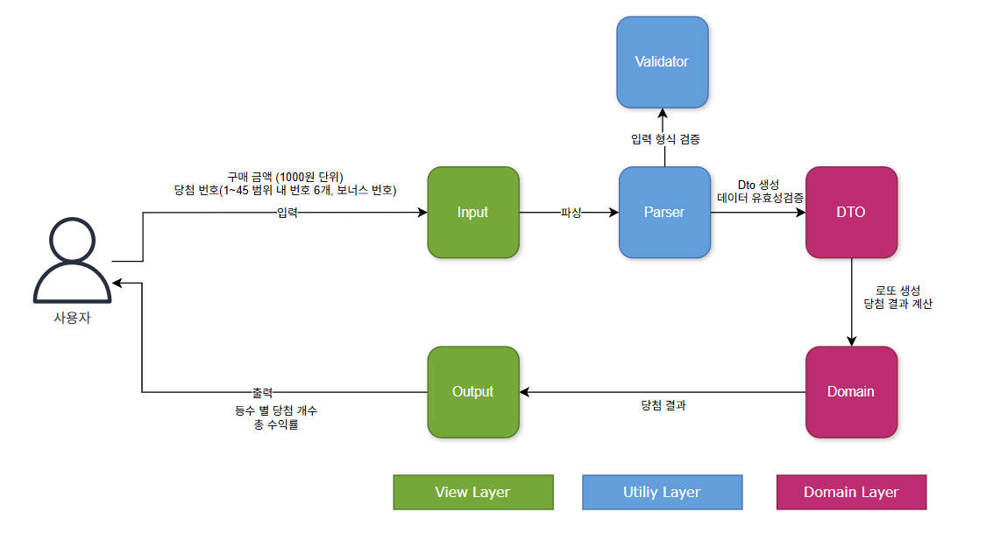

# java-lotto-precourse

## 프로젝트 소개
1~45 범위의 숫자 중 6개를 랜덤하게 선택하는 로또 게임 프로그램입니다.
구매 금액만큼 로또를 발행하고, 당첨 번호와 비교하여 당첨 결과 및 수익률을 계산합니다.

### 애플리케이션 흐름도


## 주요 기능
- 로또 자동 발행 (1,000원당 1장)
- 당첨 번호 및 보너스 번호 입력
- 등수별 당첨 통계 계산
- 수익률 계산 및 출력

## 기능 상세

### 입력
- 구매 금액을 입력받는다.
- 당첨 번호 6개를 쉼표(,)로 구분해 입력받는다.
- 보너스 번호 1개를 입력받는다.
- 사용자가 잘못된 입력을 한 경우, 해당 부분부터 다시 입력받는다.

### 출력
- 발행된 로또 번호를 출력한다.
- 당첨 통계를 출력한다.
  (각 등수별 당첨 개수 및 수익률)

### 도메인 로직
- 로또를 발행한다.
  - 번호는 1~45 범위 내의 서로 다른 숫자 6개
- 로또 구입 금액(1장당 1,000원)에 따라 여러 장의 로또를 발행한다.
- 당첨 번호를 기준으로 각 로또의 결과를 판단한다.
- 구매한 로또에 대한 전체 통계를 계산한다.
  - 등수별 당첨 횟수
  - 등수별 상금을 기준 전체 당첨 금액
    - 1등: 6개 일치 → 2,000,000,000원
    - 2등: 5개 + 보너스 일치 → 30,000,000원
    - 3등: 5개 일치 → 1,500,000원
    - 4등: 4개 일치 → 50,000원
    - 5등: 3개 일치 → 5,000원
- 구매 금액 기준 수익률을 계산한다.

## 예외 처리

### 1. 구입 금액
- 로또 1장 가격으로 나누어 떨어지지 않는 경우
- 숫자가 아닌 값을 입력한 경우
- 빈 값을 입력한 경우
- 음수 값을 입력한 경우
- long 타입의 표현 범위를 초과한 경우

### 2. 당첨 번호
- 쉼표(`,`)로 구분했을 때 6개가 아닌 경우
- 각 번호가 1~45 범위 내 정수가 아닌 경우
- 중복된 번호가 있는 경우
- int 타입의 표현 범위를 초과한 경우

### 3. 보너스 번호
- 1~45 범위 내 정수가 아닌 경우
- 불필요한 문자가 포함된 경우
- 당첨 번호와 중복되는 경우
- int 타입의 표현 범위를 초과한 경우


## 실행 예시
```
구입금액을 입력해 주세요.
8000

8개를 구매했습니다.
[8, 21, 23, 41, 42, 43]
[3, 5, 11, 16, 32, 38]
[7, 11, 16, 35, 36, 44]
[1, 8, 11, 31, 41, 42]
[13, 14, 16, 38, 42, 45]
[7, 11, 30, 40, 42, 43]
[2, 13, 22, 32, 38, 45]
[1, 3, 5, 14, 22, 45]

당첨 번호를 입력해 주세요.
1,2,3,4,5,6

보너스 번호를 입력해 주세요.
7

당첨 통계
---
3개 일치 (5,000원) - 1개
4개 일치 (50,000원) - 0개
5개 일치 (1,500,000원) - 0개
5개 일치, 보너스 볼 일치 (30,000,000원) - 0개
6개 일치 (2,000,000,000원) - 0개
총 수익률은 62.5%입니다.
```
